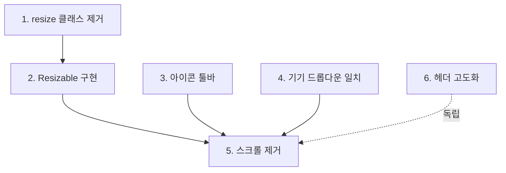

# 정제된 요구사항 문서

## 작업 요청

너는 orchestrator이며, 작업 전 orchestrator.md를 모두 읽고 이하의 작업 목록을 진행한다.

## 용어 정의

- **Primitives 페이지**: `/wizard/primitives` 라우트, `primitives-step-page.tsx`
- **FormSection**: 좌측 컨트롤 영역 (폰트, 컬러 등 설정 폼)
- **LivePreview**: 우측 미리보기 영역 (`live-preview.tsx`)
- **앵커 사이드바**: FormSection 왼쪽의 섹션 네비게이션 (현재 w-[160px])
- **위저드 헤더**: `wizard-shell.tsx`의 상단 헤더 (스텝 인디케이터, 다크모드 토글, 네비게이션 포함)
- **타겟 플랫폼**: Web/Tablet/Mobile 선택
- **기기 선택 드롭다운**: 타겟 플랫폼 하위의 Select 컴포넌트

## 현재 구현 상태 요약

### Primitives 페이지 레이아웃 (primitives-step-page.tsx)

- 최상위: `flex h-[calc(100dvh-57px)] overflow-hidden` (57px = 헤더 높이)
- 3컬럼 구조:
  1. **앵커 사이드바** (w-[160px]): 섹션 네비게이션 + 기본값 리셋 버튼
  2. **FormSection** (w-[480px]): 스크롤 가능, 6개 섹션 (폰트/컬러/타이포/스페이싱/라운딩/스타일)
  3. **LivePreview** (flex-1): `dotted-glow-bg` 배경, padding 6

### LivePreview 컴포넌트 (live-preview.tsx)

- `PreviewFrame` 컴포넌트 (L254-311):
  - 컨테이너: `className="relative h-full w-full resize overflow-hidden"` ← **resize 클래스 존재**
  - ResizeObserver로 컨테이너 크기 감지 → scale 자동 재계산
  - `getPreviewSize()`: 플랫폼별 스크린 크기 반환
  - `getMockupSize()`: 스크린 + 크롬(목업 테두리) 전체 크기 계산

### 타겟 플랫폼 / 기기 선택 (primitives-step-page.tsx, L243-278)

- `designStyle` / `platformTarget` 토글 칩
- `selectedDevice` Select 드롭다운 (DEVICE_OPTIONS에서 목록 로드)
- **현재**: `getPreviewSize()`가 selectedDevice를 받지만, 실제로는 플랫폼만 고려하고 기기 크기를 정확히 반영하지 않음

### 위저드 헤더 (wizard-shell.tsx, L29-44)

- 구조:
  - `<div className="mx-auto flex max-w-5xl items-center justify-between px-6 py-3">`
  - 좌: `<StepIndicator />`
  - 우: `<다크모드 토글> + <StepNavigation />`
- **현재**: `justify-between`으로 양끝 정렬만 존재, 중앙 정렬 없음
- **StepIndicator**: 4개 스텝, gap-2 간격, 반응형 라벨 (sm:inline)
- **StepNavigation**: 이전/다음 버튼, 마지막 스텝에서는 "프롬프트 생성" 버튼

### 최상위 스크롤 상태

- `primitives-step-page.tsx` 최상위: `overflow-hidden` 설정
- FormSection: `overflow-y-auto` (스크롤 허용)
- LivePreview 컨테이너: `overflow-hidden`
- **현재 문제**: 최상위에 스크롤이 생기고 있음 (원인 불명, 높이 계산 오류 추정)

### shadcn/ui Resizable 컴포넌트

- **현재**: 프로젝트에 설치되지 않음 (Glob 결과 없음)
- **필요**: `npx shadcn@latest add resizable` 설치 후 사용

---

## 작업 목록

### [위저드 단계: Primitives - 레이아웃 개편]

#### 1. LivePreview resize 클래스 제거

**현재 상태:**
`live-preview.tsx` L297에 `className="relative h-full w-full resize overflow-hidden"` 존재.

**변경 내용:**

- `resize` 클래스 제거 (→ `className="relative h-full w-full overflow-hidden"`)
- ResizeObserver 로직은 유지 (shadcn Resizable 드래그 시 자동 감지 필요)

**완료 기준:**
브라우저 개발자 도구로 LivePreview 컨테이너 검사 → `resize` 클래스 미포함, 우하단 리사이즈 핸들 미표시

---

#### 2. shadcn Resizable을 이용한 FormSection/LivePreview 분할

**현재 상태:**
FormSection(w-[480px])과 LivePreview(flex-1)가 고정 너비 비율.

**변경 내용:**

1. `npx shadcn@latest add resizable` 실행 (→ `app/shared/components/shadcn/resizable.tsx` 생성)
2. `primitives-step-page.tsx` 레이아웃 수정:

   ```tsx
   // 기존 (L187-285):
   <div className="w-[480px] ...">FormSection</div>
   <div className="... flex-1 ...">LivePreview</div>

   // 변경:
   import { ResizablePanelGroup, ResizablePanel, ResizableHandle } from "@shadcn/resizable"

   <ResizablePanelGroup direction="horizontal">
     <ResizablePanel defaultSize={35} minSize={25} maxSize={50}>
       <div ref={scrollRef} className="h-full overflow-y-auto p-6 space-y-10">
         {/* FormSection 내용 */}
       </div>
     </ResizablePanel>
     <ResizableHandle withHandle />
     <ResizablePanel defaultSize={65}>
       <div className="dotted-glow-bg h-full p-6">
         <LivePreview state={store} language={activeLanguage} />
       </div>
     </ResizablePanel>
   </ResizablePanelGroup>
   ```

3. defaultSize 기준: FormSection 35%, LivePreview 65% (기존 480px/나머지 비율 근사)
4. minSize/maxSize로 극단적 크기 방지 (FormSection: 25-50%)

**완료 기준:**
Primitives 페이지에서 FormSection과 LivePreview 사이 경계선 드래그 → 비율 조정 가능, 양쪽 콘텐츠 정상 렌더링. 스크린샷에 ResizableHandle(세로 구분선) 명확히 표시.

---

#### 3. 앵커 사이드바를 아이콘 툴바로 변경

**현재 상태:**
앵커 사이드바(w-[160px], L158-185): 아이콘+텍스트 버튼 6개 + 기본값 리셋 버튼.

**변경 내용:**

1. 너비 최소화: `w-[160px]` → `w-14` (56px)
2. 버튼 레이아웃:
   - 아이콘만 표시 (`section.label` 제거)
   - 중앙 정렬 (`justify-center`)
   - 호버 시 우측으로 툴팁 표시 (`@shadcn/tooltip`, `side="right"`)
3. 기본값 리셋 버튼 스타일 차별화:
   - 다른 버튼: `text-muted-foreground`, 호버 시 `bg-background/50`
   - 리셋 버튼: `border-primary/30 bg-primary/5 text-primary`, 호버 시 `bg-primary/10`
   - 상단 고정, 하단에 `Separator` 추가 후 섹션 버튼 배치

**변경 전:**

```tsx
<aside className="flex w-[160px] shrink-0 flex-col ...">
  <button ...>
    <RotateCcw className="h-3 w-3" />
    기본값
  </button>
  <nav className="space-y-1">
    <button ...>
      <section.icon className="h-4 w-4" />
      {section.label}
    </button>
  </nav>
</aside>
```

**변경 후:**

```tsx
<aside className="flex w-14 shrink-0 flex-col items-center border-r border-border bg-muted/30 py-3 gap-2">
  <TooltipProvider>
    <Tooltip>
      <TooltipTrigger asChild>
        <button ... className="... border-primary/30 bg-primary/5 text-primary hover:bg-primary/10">
          <RotateCcw className="h-4 w-4" />
        </button>
      </TooltipTrigger>
      <TooltipContent side="right">기본값으로 초기화</TooltipContent>
    </Tooltip>
  </TooltipProvider>

  <Separator />

  <nav className="space-y-1">
    {SECTIONS.map(section => (
      <Tooltip key={section.id}>
        <TooltipTrigger asChild>
          <button ...>
            <section.icon className="h-4 w-4" />
          </button>
        </TooltipTrigger>
        <TooltipContent side="right">{section.label}</TooltipContent>
      </Tooltip>
    ))}
  </nav>
</aside>
```

**완료 기준:**
앵커 사이드바 너비 56px, 아이콘만 표시. 각 버튼 호버 → 우측에 툴팁 등장. 기본값 리셋 버튼은 primary 컬러 강조 스타일. 스크린샷에 툴팁 표시 상태 캡처.

---

#### 4. 미리보기 사이즈와 기기 드롭다운 일치

**현재 상태:**

- `selectedDevice` 값: DEVICE_OPTIONS에서 선택 (예: "Desktop 1920", "iPad Pro 12.9")
- `getPreviewSize()` (live-preview.tsx L168-185): platformTarget만 고려, selectedDevice는 조회만 하고 실제 width/height 미반영

**변경 내용:**

1. `getPreviewSize()` 로직 수정:

   ```ts
   // 기존 (L168-185):
   const device = devices?.find((d) => d.name === selectedDevice);
   if (device) {
     if (platform === "web") {
       const maxHeight = 600;
       return { width: Math.round((maxHeight * 16) / 9), height: maxHeight };
     }
     // ... tablet/mobile도 고정 비율 반환
   }

   // 변경:
   const device = devices?.find((d) => d.name === selectedDevice);
   if (device) {
     if (platform === "web") {
       // 웹: 높이 600px 고정, 너비는 device.width 비율 유지
       const maxHeight = 600;
       const aspectRatio = device.width / device.height;
       return { width: Math.round(maxHeight * aspectRatio), height: maxHeight };
     }
     if (platform === "tablet") {
       // 태블릿: 높이 600px 고정, 실제 device 비율 적용
       const maxHeight = 600;
       const aspectRatio = device.width / device.height;
       return { width: Math.round(maxHeight * aspectRatio), height: maxHeight };
     }
     // 모바일: device.width/height 그대로 사용 (maxHeight 700px 제한)
     return { width: device.width, height: Math.min(device.height, 700) };
   }
   ```

2. 폴백 로직 유지 (device 미발견 시 기본값)

**완료 기준:**
기기 드롭다운에서 "Desktop 1920" 선택 → 미리보기 너비 1067px (600*16/9). "iPad Pro 12.9" (2048x2732) 선택 → 너비 450px (600*2048/2732). 개발자 도구로 PreviewFrame 내부 목업 크기 확인, 드롭다운 값과 일치.

---

#### 5. 최상위 컨테이너 스크롤 제거 및 검증

**현재 상태:**
최상위 `<div className="flex h-[calc(100dvh-57px)] overflow-hidden">`에 스크롤 발생.

**변경 내용:**

1. **조사**: 개발자 도구로 스크롤 발생 요소 특정
   - 후보: FormSection 내부 섹션 `space-y-10`, LivePreview 목업 크기 초과
   - `primitives-step-page.tsx` 전체 높이 계산 검증 (앵커 사이드바 + FormSection + LivePreview)
2. **수정**:
   - FormSection: `overflow-y-auto` 유지, 내부 padding/margin 조정
   - LivePreview: `h-full` 명시, 목업 scale 로직 확인
   - ResizablePanel에 `className="h-full"` 추가 (Resizable 도입 후)
3. **검증**:
   - Playwright 스크립트 작성:
     ```ts
     // tests/primitives-no-scroll.spec.ts
     test("Primitives 페이지 최상위 스크롤 없음", async ({ page }) => {
       await page.goto("http://localhost:5178/wizard/primitives");
       const container = page.locator("main > div").first(); // 최상위 flex 컨테이너
       const scrollHeight = await container.evaluate((el) => el.scrollHeight);
       const clientHeight = await container.evaluate((el) => el.clientHeight);
       expect(scrollHeight).toBe(clientHeight);
     });
     ```
   - 테스트 실행 후 스크린샷 첨부 (`await page.screenshot({ path: 'primitives-no-scroll.png' })`)

**완료 기준:**
Playwright 테스트 통과 (scrollHeight === clientHeight). 브라우저에서 Primitives 페이지 전체 높이가 뷰포트에 딱 맞음, 수직 스크롤바 미표시. 스크린샷에 전체 레이아웃 + 개발자 도구의 scrollHeight/clientHeight 값 동일 표시.

---

#### 6. 위저드 헤더 디자인 고도화

**현재 상태:**

- `wizard-shell.tsx` L30-43: `justify-between`만 존재, 중앙 정렬 없음
- 구성: 좌(StepIndicator) - 중앙(빈 공간) - 우(다크모드 토글 + StepNavigation)
- StepIndicator: 반응형 라벨 (sm 이하에서 숨김)

**변경 내용:**

1. **레이아웃 개선**:
   - 3컬럼 그리드 구조: `grid grid-cols-[1fr_auto_1fr]`
   - 좌: StepIndicator (왼쪽 정렬)
   - 중앙: 현재 스텝 제목 표시 (예: "디자인 프리미티브")
   - 우: 다크모드 토글 + StepNavigation (오른쪽 정렬)
2. **스타일 정제**:
   - 헤더 높이 명시: `h-14` (56px, 기존 py-3는 가변적)
   - 배경: `bg-background/95 backdrop-blur-md` (blur 강화)
   - 하단 테두리: `border-b border-border/50` (투명도 추가)
   - 그림자: `shadow-sm` 추가
3. **중앙 제목 컴포넌트**:
   ```tsx
   <div className="flex items-center justify-center">
     <h2 className="text-sm font-semibold text-foreground/80">{STEPS[current].label}</h2>
   </div>
   ```
4. **반응형 조정**:
   - 모바일(< sm): StepIndicator 라벨 숨김, 중앙 제목만 표시
   - 태블릿 이상: 3컬럼 모두 표시

**변경 전:**

```tsx
<header className="border-b border-border bg-background/80 backdrop-blur-sm sticky top-0 z-50">
  <div className="mx-auto flex max-w-5xl items-center justify-between px-6 py-3">
    <StepIndicator steps={STEPS} current={current} />
    <div className="flex items-center gap-2">
      <button ...>다크모드</button>
      <StepNavigation steps={STEPS} current={current} />
    </div>
  </div>
</header>
```

**변경 후:**

```tsx
<header className="sticky top-0 z-50 h-14 border-b border-border/50 bg-background/95 shadow-sm backdrop-blur-md">
  <div className="mx-auto grid h-full max-w-7xl grid-cols-[1fr_auto_1fr] items-center gap-4 px-6">
    {/* 좌: StepIndicator */}
    <div className="flex justify-start">
      <StepIndicator steps={STEPS} current={current} />
    </div>

    {/* 중앙: 현재 스텝 제목 */}
    <div className="flex items-center justify-center">
      <h2 className="text-sm font-semibold text-foreground/80">
        {STEPS[current].label}
      </h2>
    </div>

    {/* 우: 다크모드 + 네비게이션 */}
    <div className="flex items-center justify-end gap-2">
      <button ...>다크모드</button>
      <StepNavigation steps={STEPS} current={current} />
    </div>
  </div>
</header>
```

**완료 기준:**
위저드 헤더 높이 56px 고정, 3컬럼 그리드 레이아웃. 중앙에 현재 스텝 제목("디자인 프리미티브") 표시. 배경 blur 효과 + 그림자 적용. 스크린샷에 헤더 전체 + 개발자 도구에서 grid 레이아웃 확인.

---

## 의존 관계



- **순차 의존**: REQ1 → REQ2 → REQ5
- **병렬 가능**: REQ3, REQ4, REQ6 (REQ5 전에 완료 권장)
- **shadcn 설치 필요**: REQ2 (resizable), REQ3 (tooltip)

---

## 스크린샷 요약

| REQ | 위저드 단계 | 스크린샷 필요 | 촬영 시점                                                                   |
| --- | ----------- | ------------- | --------------------------------------------------------------------------- |
| 1   | Primitives  | O             | resize 클래스 제거 후, 개발자 도구로 className 확인                         |
| 2   | Primitives  | O             | ResizableHandle 드래그 중 + 드래그 후 비율 변경 확인 (2장)                  |
| 3   | Primitives  | O             | 아이콘 툴바 + 툴팁 호버 상태 (리셋 버튼, 일반 버튼 각 1장, 총 2장)          |
| 4   | Primitives  | O             | 기기 드롭다운 변경 전/후 미리보기 크기 비교 (Desktop 1920 vs iPad Pro, 2장) |
| 5   | Primitives  | O             | 전체 레이아웃 + 개발자 도구 scrollHeight/clientHeight 값 (1장)              |
| 6   | Primitives  | O             | 위저드 헤더 전체 + 개발자 도구 grid 레이아웃 (1장)                          |

**총 스크린샷: 9장**

---

## 정제 의사결정 로그

| #   | 원문 표현                                                                          | 해석/변환                                                                    | 근거                                                                 |
| --- | ---------------------------------------------------------------------------------- | ---------------------------------------------------------------------------- | -------------------------------------------------------------------- |
| 1   | "기존의 미리보기에 붙은 리사이즈 제거"                                             | LivePreview 컴포넌트의 `resize` 클래스 제거                                  | `live-preview.tsx` L297에 `resize` 클래스 존재 확인                  |
| 2   | "FormSection과 미리보기 사이의 경계선에 shadcn resizable을 이용해서 리사이즈 구현" | ResizablePanelGroup으로 FormSection/LivePreview 래핑, defaultSize 35%/65%    | 현재 w-[480px]/flex-1 비율 근사, shadcn URL 기반 컴포넌트 설치 필요  |
| 3   | "사이드바 아이콘 툴바로 변경, 호버 시 툴팁, 기본값 전환 아이콘은 다른 스타일"      | 너비 w-14, 아이콘만 표시, Tooltip(side="right"), 리셋 버튼 primary 컬러 강조 | 현재 w-[160px] 구조 조사, "사이즈 최소화" → 56px 적용                |
| 4   | "미리보기 사이즈가 타겟 플랫폼 아래 드롭다운 메뉴와 일치하지 않음"                 | getPreviewSize()에서 device.width/height 실제 비율 반영                      | 현재 platformTarget만 고려, DEVICE_OPTIONS 값 무시 확인              |
| 5   | "최상위 컨테이너에 현재 스크롤이 생기고 있음, 테스트 시각화로 검증"                | Playwright 테스트 작성, scrollHeight === clientHeight 검증                   | "시각화로 진행" → 스크립트 자동 검증 + 스크린샷 필요                 |
| 6   | "헤더 디자인 고도화, 웹 조사를 통해 더 유려한 디자인"                              | grid 3컬럼 레이아웃, 중앙 제목 추가, blur/shadow 강화                        | 현재 justify-between만 존재, "정렬도 규칙도 없는" → 구조적 개선 필요 |

---

## 원문 (에이전트 무시)

```
1. 기존의 미리보기에 붙은 리사이즈 제거.
2. FormSection과 미리보기 사이의 경계선에 'https://ui.shadcn.com/docs/components/radix/resizable' 를 이용해서 리사이즈 구현.
3. 가장 왼쪽에 있는 컴포넌트(폰트, 컬러...)들 있는 사이드바 아이콘 툴바로 변경 사이즈 최소화. 대신 호버 시 툴팁으로 어떤 메뉴인지 오른쪽으로 등장하면서 표시. 기본값 전환 아이콘은 다른 아이콘보다 다른 스타일로 표시.
4. 현재 미리보기 사이즈가 타겟 플렛폼 아래 드롭다운 메뉴와 일치하지 않음, 일치시킬 것.
5. 최상위 컨테이너에 현재 스크롤이 생기고 있음. 구조상 스크롤이 생길 이유가 없음. 테스트를 꼭 시각화로 진행하고 스크롤이 없는지 확인하는 검증할 것.
6. 최상위 헤더(이전, 다음 버튼이 있는) 디자인 고도화. 정렬도 규칙도 없는 상태임. 웹 조사를 통해 더 유려한 디자인을 진행할 것.
```
